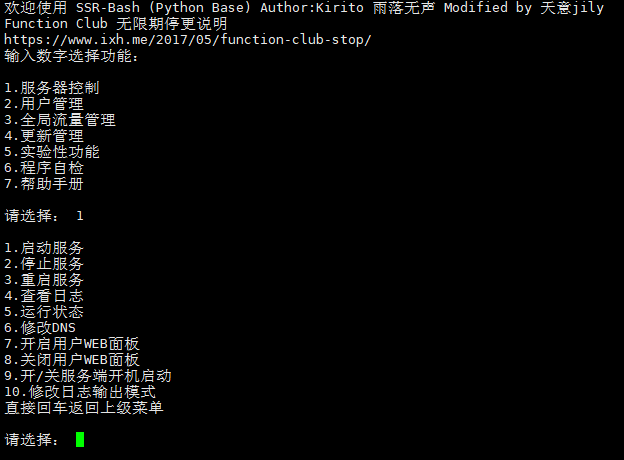

# SSR-Bash #
ShadowsocksR多用户管理脚本（基于官方mujson版本）

## 介绍 ##
一个Shell脚本，集成SSR多用户管理，流量限制，加密更改等基本操作。是一个基于ShadowsocksR官方的mujson的辅助脚本。方便用户操作

## 更新日志 ##
- 有兴趣合租或交流的请加群687437994，内有教程

- 2019-01-12 v1.5 天意修改  1.流量清空操作确认，防止误操作；
- 2018-09-30 v1.4 天意修改  1.批量查看ssrlink；
- 2018-06-02 v1.3 天意修改  1.删除BBR开启功能；
- 2018-02-27 v1.2 天意修改  1.批量添加用户功能；2.重置用户流量配置功能（需更新ssr天意改版）
- 2018-02-17 v1.1 天意修改  1.增加SSR更新功能；2.可修改日志输出方式；3.新增最新加密、协议；4.优化WEB查询；5.集成BBR开启功能
- 2017-03-08 v1.0 正式版本

## 系统支持 ##
* Ubuntu 14
* Ubuntu 16
* Debian 7
* Debian 8
* Debian 9（本人正在使用）
* CentOS 6
* CentOS 7

## 功能 ##
- 一键开启、关闭SSR服务
- 添加、删除、修改用户端口和密码
- 自由限制用户端口流量使用
- 自动修改防火墙规则
- 自助修改SSR加密方式、协议、混淆等参数
- 自动统计，方便查询每个用户端口的流量使用情况
- 自动安装Libsodium库以支持Chacha20等加密方式

## 缺点 ##
- 无法删除最后一名用户（官方限制）
- 未设置开机启动

## 安装 ##
    wget -N --no-check-certificate https://raw.githubusercontent.com/lingyongji/SSR-Bash-Python/master/install.sh && bash install.sh

## 卸载 ##
    wget -N --no-check-certificate https://raw.githubusercontent.com/lingyongji/SSR-Bash-Python/master/uninstall.sh && bash uninstall.sh
    
## 自检 ##
    wget -N --no-check-certificate https://raw.githubusercontent.com/lingyongji/SSR-Bash-Python/master/self-check.sh && bash self-check.sh

## 截图 ##

